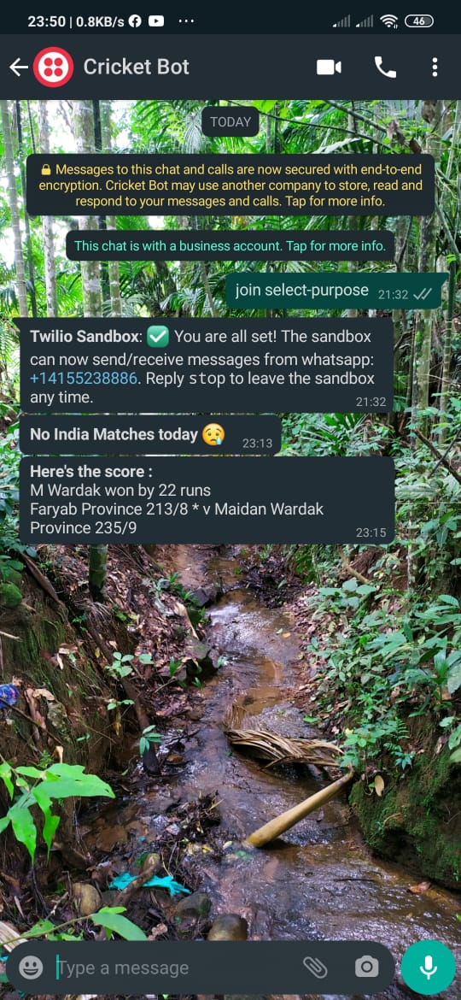

# Whatsapp Cricket Bot
Are you missing the live updates of cricket scores, just because you are busy in chatting through whatsapp.

**Don't Worry** I have an idea!! What if some bot let you know the ***live scores through whatsapp.***

This project is all about that.
---------------

### Requirements
* A Twilio account - If you dont have one just create it (***no credit card details required***)

  [new twiliio account](https://www.twilio.com/try-twilio)

* After that you have to note down two credentials:
  * Account SID
  * Auth Token
  
  ***Big tip : Don't share it with anyone*** 🤣🤣🤣
### Installation

`git clone https://github.com/rawho/whatsapp-cricket-bot.git`
`cd whatsapp-cricket-bot`
`pip3 install -r requirements.txt`

* Open cric-bot in a text editor and edit the lines 59, 60 and 64, There you have to add your credentials and your whatsapp number.

##### Now just save it and run `python3 cric-bot.py`

### Screenshots

